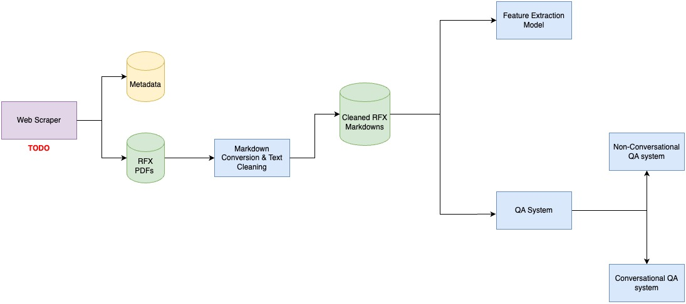

# RFX Document Processing and Question Answering System

## **Project Overview**

This project is focused on processing RFX (Request for Proposal, Tender, and Quotes) documents from British Columbia’s public procurement repository. The project consists of three main components:

1. **PDF to Markdown Conversion**: Converts PDF-based RFX documents to markdown format for further processing.
2. **Feature Extraction**: Extracts relevant details from the markdown files, such as contract value, submission deadlines, and qualifications.
3. **Question Answering (QA) System**: Allows users to interact with the processed RFX documents by asking questions. The system supports both conversational (context-preserving) and non-conversational question answering.

## **Directory Structure**

```bash
data/
├── info/
│   ├── invitation_quote/
│   ├── invitation_tender/
│   └── request_proposal/
├── markdown/
│   ├── invitation_quote/
│   ├── invitation_tender/
│   └── request_proposal/
└── pdfs/
    ├── invitation_quote/
    ├── invitation_tender/
    └── request_proposal/
src/
├── data_processing/
│   └── markdown_conversion.py
├── information_extraction/
│   └── lamma.py
├── question_answering/
│   ├── chat_system.py
│   └── qa_system.py
├── pipeline_part1.py
└── pipeline_part2.py
```

## **Project Components**

### 1. **Data Processing**

The `data_processing` module contains the script for converting PDF files to markdown. The conversion function used is `pdf_to_markdown`, which strips out images and irrelevant data from the PDFs. The resulting markdown files are cleaned and stored for further processing.

- **Key Script**: `markdown_conversion.py`

##### **Example Functionality**:
- Reads PDF files from a specified directory.
- Converts the content to markdown and stores it in a corresponding markdown folder.

### 2. **Information Extraction**

The `information_extraction` module handles feature extraction. Using the LLaMA model (or similar language models), this component processes the markdown files and extracts key features like submission dates, budget, project scope, etc.

- **Key Script**: `lamma.py`
- **Feature Extraction Class**: `RFXFeatureExtractor`

##### **Example Functionality**:
- Reads the markdown files from the `data/markdown/` directory.
- Extracts relevant fields and stores the extracted features in the `data/info/` directory as text files.

### 3. **Question Answering System**

The `question_answering` module contains two separate systems for querying the processed RFX documents.

- **Non-conversational System** (`qa_system.py`): This system answers questions independently without preserving the conversation history.
  
- **Conversational System** (`chat_system.py`): This system allows for a more interactive experience by keeping track of previous questions and answers to maintain conversation context.

##### **Key Scripts**:
- **`qa_system.py`**: For one-time question answering without history.
- **`chat_system.py`**: For preserving conversation history across multiple questions.

#### **Example Functionality**:
- User inputs a markdown file and asks questions about the content.
- The system retrieves relevant information from the document and returns answers.
- The conversational system keeps a running history to provide context in responses.

### 4. **Pipeline**

The pipeline is the end-to-end processing system that handles markdown conversion, feature extraction, and running the QA systems.

##### **Key Scripts**:
-  `pipeline_part1.py`: This script performs markdown conversion from PDF and then runs the feature extraction to process and store relevant information.
-  `pipeline_part2.py`: This script runs the question answering systems (conversational or non-conversational) allowing users to ask questions based on the processed RFX markdown documents.

## **How to Run the Project**
##### **Prerequisites**
Ensure you have installed the required Python libraries:
```bash
pip install transformers pdfplumber markdownify torch
```
##### **Steps to Run**:
**1. Run Pipeline1 for PDF to Markdown conversion and information extraction**:
```bash
python src/scraper/pipeline_part1.py
```
**2. Run Pipeline2 for the QA System:**
```bash
python src/scraper/pipeline_part2.py
```


## **Theory: Pipeline Flow**



The pipeline for processing RFX documents is structured to handle the ingestion, processing, and interaction with the data in a step-by-step manner. Below is an explanation of each component:

### 1. **Scraping RFX Data**:
   - **Purpose**: The project originally intended to begin with a web scraper that collects RFX documents from a specified repository (like BC Bid). It would fetch the metadata and PDF documents for each procurement opportunity.
   - **Status**: Since building the web scraper was taking too long, it was skipped for now. However, it would be a valuable feature to implement in the future.
   - **Future Flow**:
     - Scraper would download the PDFs from the specified website.
     - Metadata would be saved in a structured format (e.g., CSV or Excel).

### 2. **Markdown Conversion**:
   - **Purpose**: The PDFs are converted into markdown files, which are easier to process for feature extraction.
   - **Flow**:
     - The PDFs are stripped of images and irrelevant data.
     - Only the text content is retained and saved in markdown format for later use.
   
   **Note**: To reduce the load on the language model, extracting the relevant sections from the documents will be required. For this task, domain knowledge is necessary, and it will also allow us to efficiently handle postings that include multiple files.

### 3. **Feature Extraction**:
   - **Purpose**: The markdown documents are processed by a language model (LLaMA in this case) to extract key information about the RFX.
   - **Flow**:
     - Each markdown document is passed through the model.
     - The model extracts key fields like deadlines, contract values, submission requirements, etc.
     - The extracted information is saved as structured text files in the `data/info/` folder.
   
   **Note**: Currently, the feature extraction is done using a large LLM (like LLaMA), which works well but requires a lot of computational resources. If domain knowledge and a fixed set of information fields were available, a much simpler model like RoBERTa could be used. This is because restricting the search space makes it easier for simpler models to achieve similar performance.

### 4. **Question Answering System**:
   - **Purpose**: The QA system enables users to interact with the processed RFX documents by asking questions.
   - **Flow**:
     - Users select a markdown document and type their questions.
     - The system provides answers based on the extracted data.
     - Two modes are available: conversational (preserving context) and non-conversational (independent answers).

## **Final Notes: Assumptions and Constraints**

While developing this pipeline, the following assumptions and constraints were considered:

1. **Lack of Domain Knowledge**:
   - For this pipeline, I did not have much information about the domain of the data. This posed a challenge in designing more efficient extraction techniques, as domain-specific knowledge could have helped narrow down the relevant sections of the documents. In future iterations, incorporating domain expertise will improve both the accuracy and efficiency of the information extraction process.

2. **Single Document Handling**:
   - The current version of the pipeline only processes RFX posts that contain a **single document**. RFX opportunities often include multiple documents, such as appendices, additional forms, or attachments. However, since I focused on simplifying the extraction process, I **skipped posts with multiple documents**. In future versions, adding support for multi-document posts would allow the pipeline to handle a larger variety of RFX opportunities.

3. **Computational Constraints**:
   - The current feature extraction model relies on a large language model (LLM) to extract key information from the markdown files. While this approach is powerful, it is also computationally expensive and may not scale well for larger datasets. As mentioned earlier, if domain knowledge and a fixed set of information fields were available, a simpler model like RoBERTa could be used to reduce the computational load while maintaining acceptable performance.

4. **Data Availability**:
   - The data used in this pipeline comes from RFX posts that I manually selected. The lack of a fully integrated web scraper limited the scope of the project. Automating the data collection process through scraping would significantly enhance the ability to scale this pipeline and ensure that a larger pool of RFX documents is processed.
   - The scraping feature was skipped for now due to time constraints, but it will be a valuable addition in future updates to streamline the data collection process.

### **Future Improvements**
- Incorporate domain knowledge to improve the relevance of extracted sections.
- Add support for multi-document handling within RFX posts.
- Optimize the pipeline to work with more efficient models for feature extraction when the information being extracted is fixed and domain-specific.
- Implement the web scraping component to automatically pull RFX documents from the web, ensuring continuous and automated data collection.

